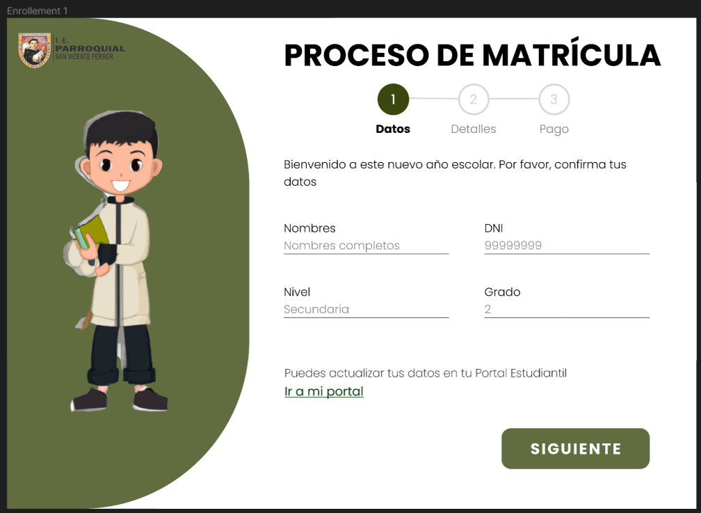
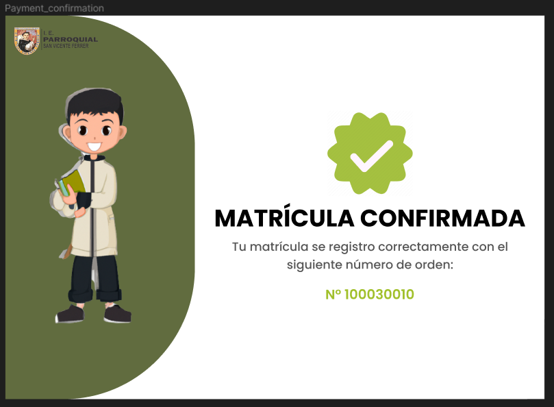
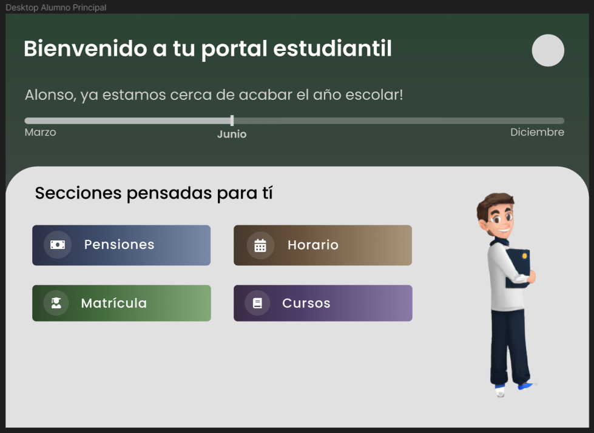
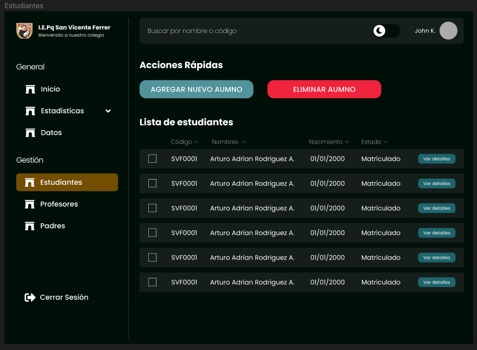
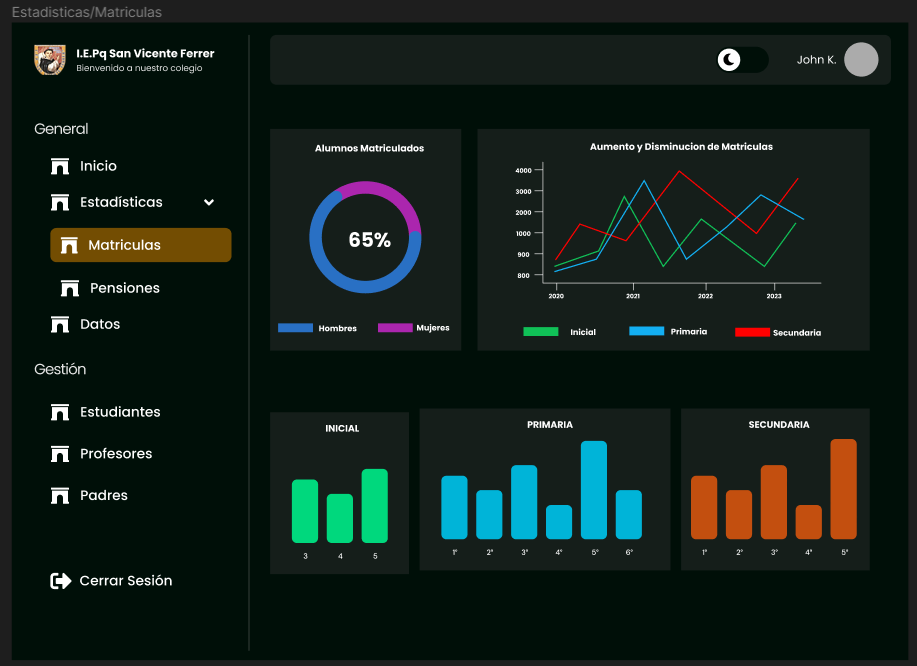

# Plataforma Web para el Colegio San Vicente Ferrer
Este repositorio contiene el código fuente de la plataforma web para el Colegio San Vicente Ferrer. Las funcionalidades de la plataforma incluyen:
- Sistema de matrícula
- Intranet para el personal
- Intranet para los estudiantes

## Tecnologías usadas
Este proyecto fue desarrollado usando las siguientes tecnologías:
- React JS
  - Axios
  - React Query
  - React Router Dom
  - Styled Components
  - Formik
  - React Icons

## Prerrequesitos
Este proyecto fue desarrollado junto a su propio API, la cual se encuentra en el siguiente repositorio: [Ir al repositorio de la API](https://github.com/jorgevfx/svf-api)  

## Instalación
Para poder ejecutar el proyecto, se deben seguir los siguientes pasos:
1. Clonar el repositorio
2. Instalar las dependencias
```bash
npm install
```
3. Correr el proyecto
```bash
npm run dev
```

## Vistas del proyecto
A continuación, se muestran algunas vistas del proyecto:
### Matrícula del estudiante



### Intranet del estudiante


### Intranet del personal



Para ver las vistas completas del proyecto, se puede acceder al siguiente enlace:
[Ir a Figma](https://www.figma.com/file/oVrwAfsvnDVX5xmdso4VvA/SVF-UI-DESIGN?type=design&node-id=0%3A1&mode=design&t=3tGkyTqEwh1c9ZdO-1)

## Equipo de trabajo
Este proyecto fue desarrollado por:
- [James](https://github.com/JamesVC7)
- [Jorge](https://github.com/jorgevfx)
